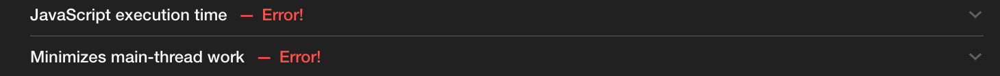

# Pourquoi apprendre à utiliser Webpack ?

webpack est aujourd'hui un outil très rependu dans le monde du développement web frontend.
Il est soit utilisé directement ou soit par l'intermédiaire de toolkit (Vue-CLI, Angular-CLI, CRA, etc...).

Son usage peut sembler compliquer dans un premier temps, mais la magie interne est relativement simple à appréhender.

> Si son usage peut être masqué par un toolkit, pourquoi devrait-on l'apprendre alors ?

Il se trouve que webpack, même si embarqué dans un toolkit, est un outil sur lequel le développeur web va devoir agir afin de pouvoir y intégrer sa configuration spécifique.
Le développeur peut aussi vouloir jouer sur les performances de son _build_.

S'attaquer à faire évoluer une configuration webpack auto générée peut être très compliquée.
Comme toujours, le code auto généré peut faire gagner beaucoup de temps au début, mais en fera perdre beaucoup par la suite.

Pour ne pas se retrouver dans cette situation, il est très intéressant d'apprendre les concepts et les bases de webpack par le biais de quelques exemples.

## Qu'est ce que Webpack ?

Ok il est intéressant d'apprendre à utiliser webpack. Mais qu'est-ce que webpack ?

webpack est un outil de _packaging_ de fichiers JS pour le web.
Il permet aux développeur d'écrire du code JS modulaire (sans l'obliger à tout écrire dans un fichier, ou de devoir gérer une concaténation de fichier à la main).

Par _packaging_, on ne parle pas d'emballage ou de _package_ au sens NPM. Il s'agit d'un archive _préparée_ pour le web.

webpack apporte plusieurs fonctionnalités majeures:

- Il résout l'arbre de dépendance des modules qu'il a en entrée afin de construire un graph complet de toutes les dépendances (interne ou dépendance NPM).
- Il concatène les fichiers sous la forme de _bundles_ en suivant la configuration de ses _sorties (output)_ tout en conservant les scopes JS.
- Il permet de charger uniquement le JS nécessaire pour la page.

Combien de fois avez vous vu ce message lors de l'usage d'outils comme PageSpeed, Dareboost, Speedcurve, LightHouse ou autres ?

L'usage de webpack ne se limite pas qu'au JS,à une cible web.
Vous pourrez, par les différents ateliers disponible ici apprendre à utiliser des fonctionnalités avancées.
