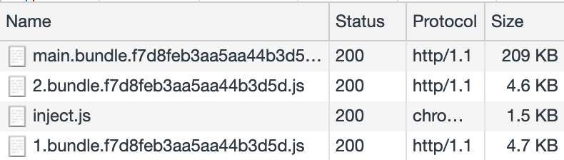

# Retour vers le futur :recycle:

> Pour démarrer cet exercice, sois sûr d'être dans le dossier `./packages/intermediate/modern-build`.
> Sois également sûr d'avoir [installé ce dépôt d'abord](../README.md#install)

## Introduction

Essayez de démarrer cette application avec `yarn build`.
Ouvrez l'application dans votre navigateur et regardez la taille et le contenu du bundle JS.

::: tip Regarde !
Vous devriez remarquer que :

- il est assez énorme comparé aux autres.
- le JS est assez vieux (il ne possède pas les dernière fonctionnalités de votre navigateur).
- babel debug devrait être très verbeux.
  :::

Vous devriez voir les logs de débogage de babel comme ceci :

```txt{9}
@babel/preset-env: `DEBUG` option

Using targets:
{
  "android": "4.4.3",
  "chrome": "71",
  "edge": "17",
  "firefox": "64",
  "ie": "10",
  "ios": "11.3",
  "opera": "56",
  "safari": "11.1"
}

Using modules transform: auto

Using plugins:
  transform-template-literals { "android":"4.4.3", "ie":"10" }
  transform-literals { "android":"4.4.3", "ie":"10" }
  transform-function-name { "android":"4.4.3", "edge":"17", "ie":"10" }
  transform-arrow-functions { "android":"4.4.3", "ie":"10" }
  transform-block-scoped-functions { "android":"4.4.3", "ie":"10" }
  transform-classes { "android":"4.4.3", "ie":"10" }
  transform-object-super { "android":"4.4.3", "ie":"10" }
  transform-shorthand-properties { "android":"4.4.3", "ie":"10" }
  transform-duplicate-keys { "android":"4.4.3", "ie":"10" }
  transform-computed-properties { "android":"4.4.3", "ie":"10" }
  transform-for-of { "android":"4.4.3", "ie":"10" }
  transform-sticky-regex { "android":"4.4.3", "ie":"10" }
  transform-dotall-regex { "android":"4.4.3", "edge":"17", "firefox":"64", "ie":"10" }
  transform-unicode-regex { "android":"4.4.3", "ie":"10", "ios":"11.3", "safari":"11.1" }
  transform-spread { "android":"4.4.3", "ie":"10" }
  transform-parameters { "android":"4.4.3", "edge":"17", "ie":"10" }
  transform-destructuring { "android":"4.4.3", "edge":"17", "ie":"10" }
  transform-block-scoping { "android":"4.4.3", "ie":"10" }
  transform-typeof-symbol { "android":"4.4.3", "ie":"10" }
  transform-new-target { "android":"4.4.3", "ie":"10" }
  transform-regenerator { "android":"4.4.3", "ie":"10" }
  transform-exponentiation-operator { "android":"4.4.3", "ie":"10" }
  transform-async-to-generator { "android":"4.4.3", "ie":"10" }
  proposal-async-generator-functions { "android":"4.4.3", "edge":"17", "ie":"10", "ios":"11.3", "safari":"11.1" }
  proposal-object-rest-spread { "android":"4.4.3", "edge":"17", "ie":"10" }
  proposal-unicode-property-regex { "android":"4.4.3", "edge":"17", "firefox":"64", "ie":"10" }
  proposal-json-strings { "android":"4.4.3", "edge":"17", "ie":"10", "ios":"11.3", "safari":"11.1" }
  proposal-optional-catch-binding { "android":"4.4.3", "edge":"17", "ie":"10" }
  transform-named-capturing-groups-regex { "android":"4.4.3", "edge":"17", "firefox":"64", "ie":"10" }
```



Notez comment les navigateurs abandonnés, tels qu'Internet Explorer 10 , sont inclus dans cette liste.
C'est un problème car les navigateurs non supportés n'auront pas de nouvelles fonctionnalités ajoutées, et Babel continue à transposer la syntaxe spécifique pour eux.
Cela augmente inutilement la taille de votre bundle si les utilisateurs n'utilisent pas ce navigateur pour accéder à votre site.

Babel enregistre également une liste des plugins de transformation utilisés :

C'est une longue liste ! Ce sont tous les plugins que Babel doit utiliser pour transformer toute syntaxe ES2015+ en syntaxe plus ancienne pour tous les navigateurs ciblés.

## Reduisons le nombre de polyfill :chart_with_downwards_trend:

Grâce à la fonctionnalité `babel-preset-env` `useBuiltIns`, nous avons pu essayer de supprimer les polyfill inutiles.

Essayons ça !

:::tip
:information_source: Un polyfill est une prothèse d'émulation.
En d'autres termes, c'est un morceau de code rétro-compatible qui permet de remplacer une syntaxe plus récentes.
:::

<details>
<summary>Solution</summary>

```json{7}
{
  "presets": [
    [
      "@babel/preset-env",
      {
        "targets": "last 2 versions",
        "useBuiltIns": "usage",
        "debug": true
      }
    ]
  ],
  "plugins": ["@babel/plugin-syntax-dynamic-import"]
}
```

</details>

::: tip
Vous devriez voir dans les logs que babel n'a pas inclus tous les polyfills. Mais la taille des paquets ne change pas beaucoup. :tada:
:::

## Mettons à jour nos cibles !

Lorsque vous avez une très grande cible de navigateur (les anciennes et les toutes nouvelles), vous devez générer deux cibles.

Grâce à la fonctionnalité `type="module"` du navigateur web moderne, vous pouvez générer un gros bundle es5 et un tout nouveau paquet ES2018.

Pour ce faire, essayons de générer des modules de type target avec [Babel](https://babeljs.io/docs/en/babel-preset-env#targetsesmodules).

N'hésitez pas à utiliser [ScriptExtHtmlWebpackPlugin](https://github.com/numical/script-ext-html-webpack-plugin) qui est déjà inclu dans le projet

<details>
<summary>Solution</summary>

```json{6-8}
{
  "presets": [
    [
      "@babel/preset-env",
      {
        "targets": {
          "esmodules": true
        },
        "useBuiltIns": "usage",
        "debug": true
      }
    ]
  ],
  "plugins": ["@babel/plugin-syntax-dynamic-import"]
}
```

```js{5,15,53-62}
const path = require("path");
const HtmlWebpackPlugin = require("html-webpack-plugin");
const CleanWebpackPlugin = require("clean-webpack-plugin");
const VueLoaderPlugin = require("vue-loader/lib/plugin");
const ScriptExtHtmlWebpackPlugin = require("script-ext-html-webpack-plugin");

module.exports = {
  mode: "production",
  entry: "./src/main.js", // The source module of our dependency graph
  devServer: {
    contentBase: "./dist"
  },
  output: {
    // Configuration of what we tell webpack to generate (here, a ./dist/main.js file)
    filename: "[name].bundle.[hash].mjs",
    path: path.resolve(__dirname, "dist")
  },
  module: {
    rules: [
      {
        test: /\.js$/,
        exclude: /node_modules/,
        loader: "babel-loader"
      },
      {
        test: /\.jpg$/,
        use: [
          {
            loader: "file-loader",
            options: {
              outputPath: "assets",
              publicPath: "assets"
            }
          }
        ]
      },
      {
        test: /\.(sass|css)$/,
        use: ["style-loader", "css-loader", "sass-loader"]
      },
      {
        test: /\.vue$/,
        use: "vue-loader"
      }
    ]
  },
  plugins: [
    new VueLoaderPlugin(),
    new CleanWebpackPlugin("dist"),
    new HtmlWebpackPlugin({
      template: "./src/index.html"
    }),
    new ScriptExtHtmlWebpackPlugin({
      module: /\.mjs$/,
      custom: [
        {
          test: /\.js$/,
          attribute: "nomodule",
          value: ""
        }
      ]
    })
  ]
};
```

</details>

::: tip
Nous verrons dans d'autres étapes comment utiliser plus d'une seule configuration webpack dans un même projet.
:::
