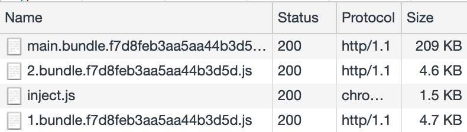

# Modern build :recycle:

> To start this exercise, be sure to be in `./packages/intermediate/modern-build` folder.
> Be sure you have [installed this repository first](../README.md#install)

## Introduction

Try to start this application with `yarn build`.
Open the app in your browser and look at the JS bundle size and content.

::: tip Look out !
You should notice that :

- main bundle is pretty huge compared to others.
- JS in bundle is pretty old for your fresh browser.
- babel debug should be very verbose.
  :::

You should see babel debug logs like this:

```txt{9}
@babel/preset-env: `DEBUG` option

Using targets:
{
  "android": "4.4.3",
  "chrome": "71",
  "edge": "17",
  "firefox": "64",
  "ie": "10",
  "ios": "11.3",
  "opera": "56",
  "safari": "11.1"
}

Using modules transform: auto

Using plugins:
  transform-template-literals { "android":"4.4.3", "ie":"10" }
  transform-literals { "android":"4.4.3", "ie":"10" }
  transform-function-name { "android":"4.4.3", "edge":"17", "ie":"10" }
  transform-arrow-functions { "android":"4.4.3", "ie":"10" }
  transform-block-scoped-functions { "android":"4.4.3", "ie":"10" }
  transform-classes { "android":"4.4.3", "ie":"10" }
  transform-object-super { "android":"4.4.3", "ie":"10" }
  transform-shorthand-properties { "android":"4.4.3", "ie":"10" }
  transform-duplicate-keys { "android":"4.4.3", "ie":"10" }
  transform-computed-properties { "android":"4.4.3", "ie":"10" }
  transform-for-of { "android":"4.4.3", "ie":"10" }
  transform-sticky-regex { "android":"4.4.3", "ie":"10" }
  transform-dotall-regex { "android":"4.4.3", "edge":"17", "firefox":"64", "ie":"10" }
  transform-unicode-regex { "android":"4.4.3", "ie":"10", "ios":"11.3", "safari":"11.1" }
  transform-spread { "android":"4.4.3", "ie":"10" }
  transform-parameters { "android":"4.4.3", "edge":"17", "ie":"10" }
  transform-destructuring { "android":"4.4.3", "edge":"17", "ie":"10" }
  transform-block-scoping { "android":"4.4.3", "ie":"10" }
  transform-typeof-symbol { "android":"4.4.3", "ie":"10" }
  transform-new-target { "android":"4.4.3", "ie":"10" }
  transform-regenerator { "android":"4.4.3", "ie":"10" }
  transform-exponentiation-operator { "android":"4.4.3", "ie":"10" }
  transform-async-to-generator { "android":"4.4.3", "ie":"10" }
  proposal-async-generator-functions { "android":"4.4.3", "edge":"17", "ie":"10", "ios":"11.3", "safari":"11.1" }
  proposal-object-rest-spread { "android":"4.4.3", "edge":"17", "ie":"10" }
  proposal-unicode-property-regex { "android":"4.4.3", "edge":"17", "firefox":"64", "ie":"10" }
  proposal-json-strings { "android":"4.4.3", "edge":"17", "ie":"10", "ios":"11.3", "safari":"11.1" }
  proposal-optional-catch-binding { "android":"4.4.3", "edge":"17", "ie":"10" }
  transform-named-capturing-groups-regex { "android":"4.4.3", "edge":"17", "firefox":"64", "ie":"10" }
```



Notice how discontinued browsers, such as Internet Explorer, are included in this list. This is a problem because unsupported browsers won't have newer features added, and Babel continues to transpile specific syntax for them. This unnecessarily increases the size of your bundle if users are not using this browser to access your site.

Babel also logs a list of transform plugins used:

That's a pretty long list! These are all the plugins that Babel needs to use to transform any ES2015+ syntax to older syntax for all the targeted browsers.

## Reduce polyfill

Thanks to `babel-preset-env` [useBuiltIns](https://babeljs.io/docs/en/babel-preset-env#usebuiltins) feature, we could try to remove useless polyfill.

Let's try this!

<details>
<summary>Solution</summary>

```json{7}
{
  "presets": [
    [
      "@babel/preset-env",
      {
        "targets": "last 2 versions",
        "useBuiltIns": "usage",
        "debug": true
      }
    ]
  ],
  "plugins": ["@babel/plugin-syntax-dynamic-import"]
}
```

</details>

::: tip
You should see in logs that babel did not include all the polyfills. But the size of bundles does not change much. :tada:
:::

## Focus a new target !
